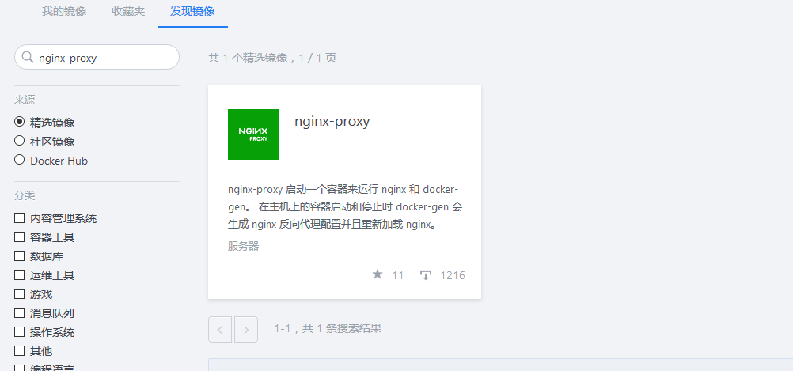
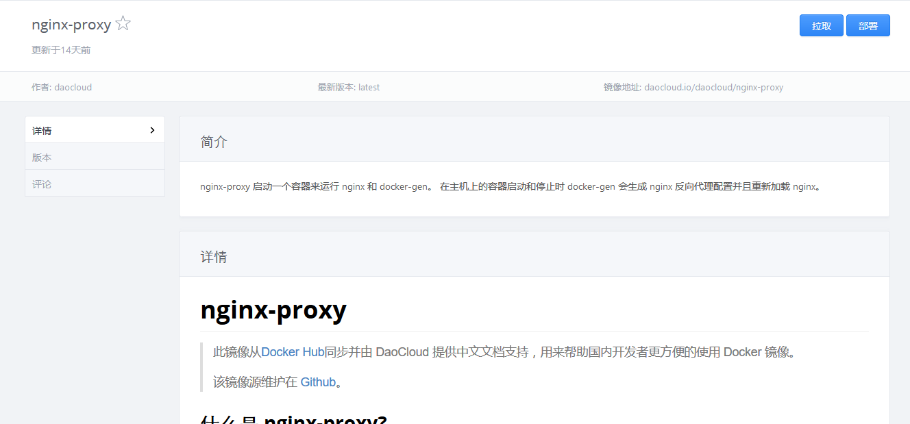
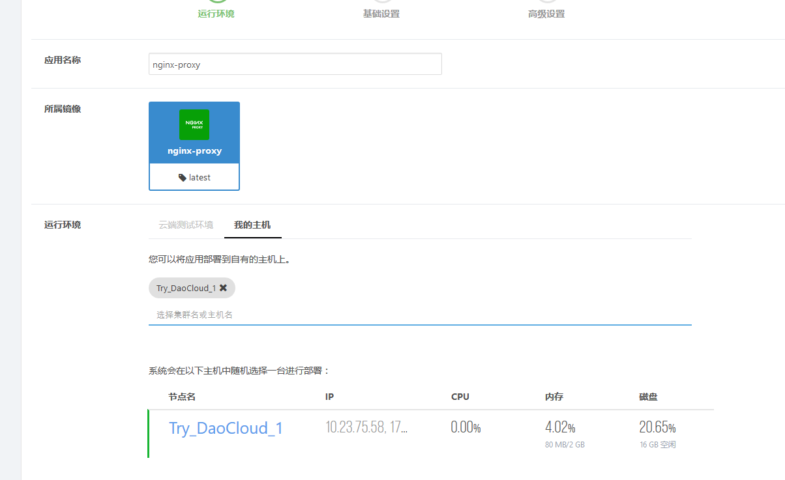
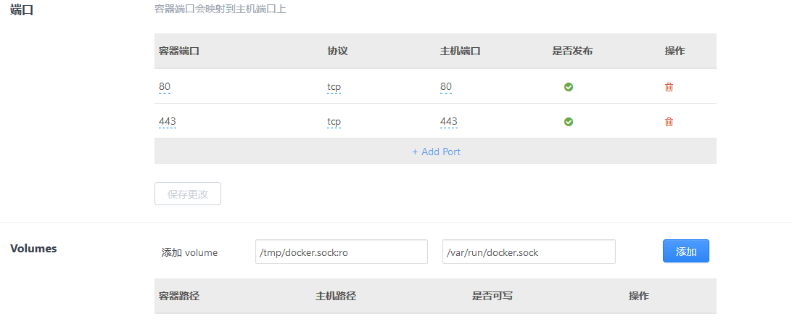
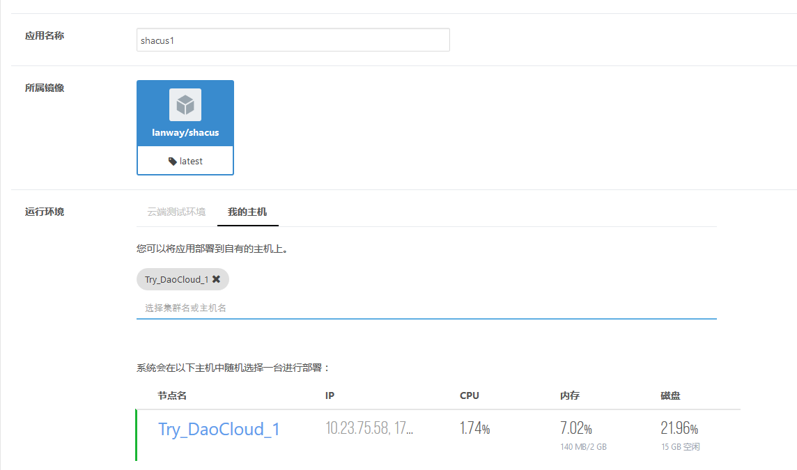
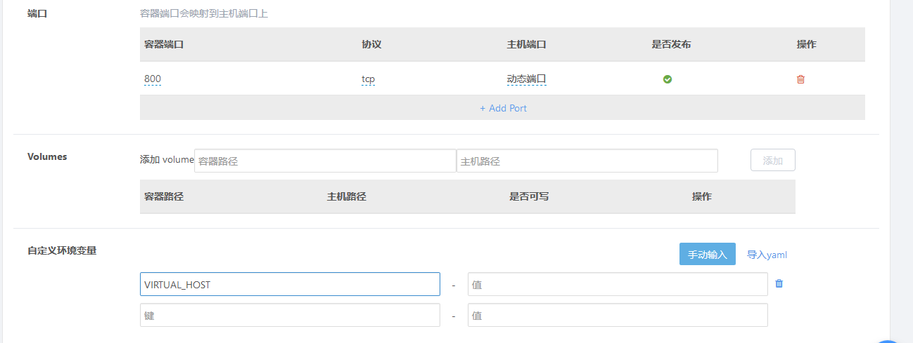
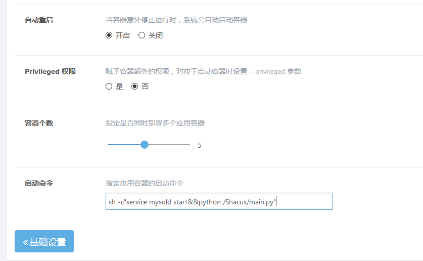
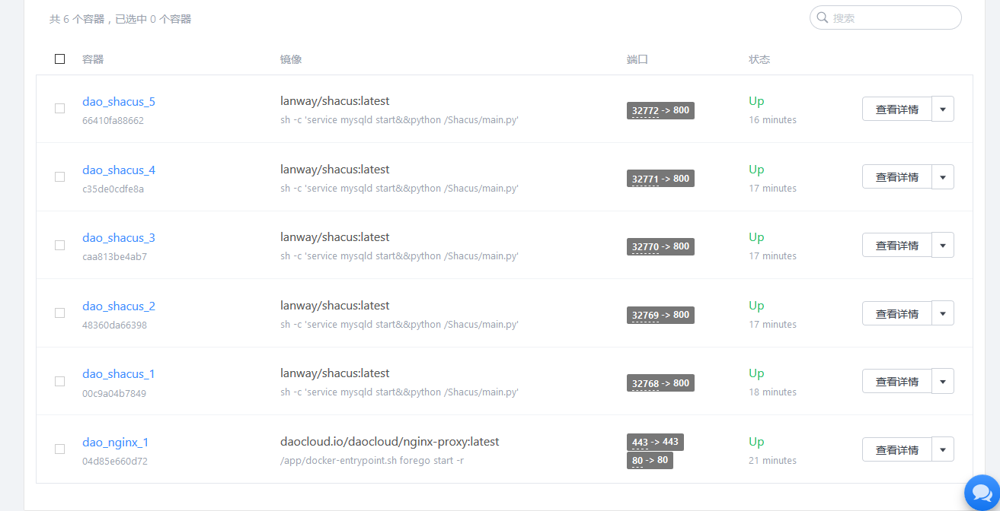

## 首先进入Daocloud中搜索nginx-proxy镜像，此镜像用于实现负载均衡

##  

进入后点击部署：

输入应用名称，选择所属镜像（即镜像的版本）和运行环境（即你需要部署在哪些主机上）

 

监听机器的 80、443 端口，这样端口上的流量由 nginx-proxy 来负载分配。

 把 docker.sock 映射到 nginx-proxy 容器中，这样容器变动时需要映射的路径会被自动检测到。

 

对于配置好 proxy 的主机，每当在主机上启动一个容器的时候，nignx-proxy 都会自动检查该容器是否含有 VIRTUAL_HOST 这个环境变量，当检查到某个刚启动的容器含有这个环境变量时，便会自动修改 nginx，负载这个域名的流量到容器。 

## 接下来我们部署我们自己的镜像

搜索我们自己的镜像点击部署

 

映射容器的800端口（即暴露容器的800端口使得外部可以访问，由于我们的程序时开在800端口的，因此暴露800）

并且添加环境变量VIRTUAL_HOST 值为服务器的ip地址 

调整容器个数为5，并输入启动命令 sh -c"service mysqld start&&python /Shacus/main.py"使得在容器启动时启动数据库和服务器。

 

至此，我们的项目就部署完成了，我们查看一下详情

 