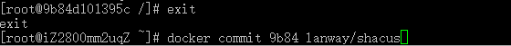

# docker学习

## 1.docker安装

## 1.1基于centos6.5 以及内核版本为3.10进行安装

1.1.1 升级内核至3.10

​	通过yum源升级内核，在yum的ELRepo源中，有 m ain l ine（3.13.1）、 l ong- t erm（3.10.28）这2个内核版本，考虑到long-term更稳定，会长期更新，所以选择这个版本。

​	1.导入public key

rpm --import https://www.elrepo.org/RPM-GPG-KEY-elrepo.org

​	2、安装ELRepo到CentOS-6.5中

rpm -ivh http://www.elrepo.org/elrepo-release-6-5.el6.elrepo.noarch.rpm

​	 3、安装 kernel-lt（lt=long-term）

yum --enablerepo=elrepo-kernel install kernel-lt -y

​	或者安装kernel-ml（ml=mainline）

yum --enablerepo=elrepo-kernel install kernel-ml -y

​	4、编辑grub.conf文件，修改Grub引导顺序

  

将default改成内核为3.10的那个，一般新安装的默认排在第一个，所以设置default=0

​	5.重启，查看内核版本号

​	reboot

​	uname -r

## 1.2 docker 1.7安装

搜寻了很久，也没有看到满足centos6的在docker1.7以上的yum源，固只好安装docker1.7版本

1.添加yum源

vim /etc/yum.repos.d/docker.repo

向里面写入：

[dockerrepo]
name=Docker Repository
baseurl=https://yum.dockerproject.org/repo/main/centos/6/
enabled=1
gpgcheck=1
gpgkey=https://yum.dockerproject.org/gpg

保存退出

2.查看yum源是否添加成功

yum repolist 

 

可以看到添加成功，yum源中有两个status

3.安装docker-engine

yum install docker-engine 

4.启动docker

在centos6中，用service docker start 启动docker

 

## 1.3 docker卸载

1.yum list installed | grep docker 

 

2、卸载docker安装包

sudo yum -y remove docker-engine.x86_64

3.删除docker镜像

rm -rf /var/lib/docker

# docker基本命令

docker ps 查看正在运行的容器   

docker ps -a 查看所有的容器，包括已经停止了的

docker rm $(docker pa -a -q) 删除所有的容器

docker rm <容器名或ID> 删除单个容器

docker stop <容器名或ID> 停止单个容器

docker start <容器名或ID> 开始单个容器

docker kill <容器名或ID> 杀死单个容器

docker images 查看所有的镜像

docker rmi $(docker images | grep none | awk '{print $3}' | sort -r) 删除所有的镜像

docker run --name redmine -p 9003:80 -p 9023:22 -d -v /var/redmine/files:/redmine/files -v /var/redmine/mysql:/var/lib/mysql sameersbn/redmine  运行一个新容器，同时为它命名、端口映射、文件夹映射。以redmine镜像为例

docker rmi $(docker images -q) 删除所有镜像

docker rmi <镜像名或ID> 删除单个镜像

docker rmi $(docker images -q | awk '/^<none>/ { print $3 }')  删除所有未打tag的镜像

有时在启动Docker Container时需要同时运行不止一条命令，这时在command处使用：sh -c ' cmd1 && cmd2 '即可。

如，docker run -it myimage sh -c 'service MySQL start && Python test.py'

# 制作镜像

下载centos6镜像作为基础镜像

docker pull centos：6

docker run -i -t centos /bin/bash

以交互模式运行centos镜像

在镜像中配置环境

配置环境见另一篇文章

配置好之后 先exit退出容器，再用docker commit 命令

 

9b84为容器id的前几位，不用写全，只需要能够区分各种容器就行

